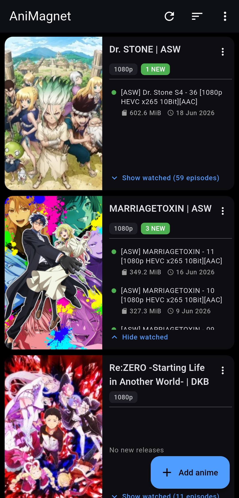

<p align="center">
  
</p>

# AniMagnet

A Flutter Android app for tracking and downloading anime torrent releases from [nyaa.si](https://nyaa.si).



---

## About

This app was born out of necessity after [AnimeTosho](https://animetosho.org) — my primary torrent aggregator for anime — shut down. AnimeTosho made it incredibly easy to find, filter, and grab releases in one place. Without it, using nyaa.si directly felt clunky, especially on mobile. Scrolling through nyaa in a browser, manually searching for each show, and juggling which releases I had and hadn't grabbed was a pain.

I wanted a proper mobile app built around my workflow: a watchlist of ongoing anime that surfaces new releases the moment they're up, with one tap to open the magnet link in my torrent app. Since I have no background in Android development, this app was **built entirely by Claude (Anthropic's AI)**. I described what I wanted, Claude wrote every line of Dart/Flutter code, and the result is exactly the app I was looking for.

---

## Features

- **Watchlist** — track ongoing anime by title, release group, and quality (e.g. `Solo Leveling · SubsPlease · 1080p`)
- **Auto-add** — search a title, pick the release version you want from episode 1 results, and the pattern is saved automatically
- **Release feed** — on launch and pull-to-refresh, queries each entry's nyaa RSS, filters to matching releases (newest first), shows size and publish date
- **Seen/unseen tracking** — only unseen releases shown by default; tap to expand watched ones. Opened releases lose the NEW dot automatically
- **One-tap magnet** — tap a release to open the magnet link directly in your torrent app
- **Predictive notifications** — learns each anime's posting cadence from past releases and schedules a local notification ~15 min after the predicted next post, so you get pinged without keeping the app open
- **Cover art** — pulled from AniList by title and cached on disk
- **Title sorting** — sort your watchlist alphabetically
- **Per-anime notification toggle** — enable or disable release alerts on a per-show basis
- **AMOLED black UI** with blue accents

---

## Download

Grab the latest APK from the [Releases](../../releases) page and sideload it onto your device.

---

## Build from Source

### Requirements

- **Flutter SDK** (stable channel) — [install guide](https://docs.flutter.dev/get-started/install/windows)
- **JDK 17** — must be exactly 17 or 21. JDK 22+ breaks the Android build pipeline. [Temurin 17](https://adoptium.net) recommended
- **Android SDK** — Command-line tools only (no Android Studio needed). [Download here](https://developer.android.com/studio#command-line-tools-only)

After installing, point Flutter at them:
```powershell
flutter config --jdk-dir "C:\path\to\jdk17"
flutter config --android-sdk "C:\Android"
flutter doctor
```

### Build

```powershell
git clone https://github.com/MD-1909/AniMagnet.git
cd AniMagnet
flutter pub get
flutter build apk --release
```

Output: `build/app/outputs/flutter-apk/app-release.apk`

Install on a connected device:
```powershell
adb install build/app/outputs/flutter-apk/app-release.apk
```

---

## Project Structure

```
lib/
  main.dart                    app entry + AMOLED dark theme + service wiring
  models/
    release.dart               one parsed nyaa torrent
    watch_entry.dart           tracked anime (title/group/quality, match + searchTitle)
  services/
    nyaa_service.dart          RSS fetch/parse, magnet construction, version search
    anilist_service.dart       GraphQL cover-art lookup
    storage_service.dart       shared_preferences (watchlist + seen GUIDs)
    posting_predictor.dart     median-interval prediction of next episode post time
    notification_service.dart  schedules predicted alerts (+15 min) via inexact alarms
  screens/
    home_screen.dart           anime cards: art left, unseen releases right, expand watched
    add_entry_screen.dart      search → pick version → save pattern
    edit_entry_screen.dart     manual add/edit
  widgets/
    release_tile.dart          compact release row: NEW dot + size/date/seeders + magnet
```

### How Predictive Notifications Work

`PostingPredictor` collects the publish times of past matching releases, collapses near-duplicate re-uploads (within 12h), and uses the **median interval** between posts to predict the next one. The alert fires at `predicted + 15 min` using an inexact alarm (no `SCHEDULE_EXACT_ALARM` permission needed). Re-armed on every refresh. Requires at least 2 past releases to make a prediction.

---

## Notes

- nyaa RSS doesn't include magnet links — they're constructed from `<nyaa:infoHash>` plus public trackers
- Episode-1 detection in the add flow is heuristic; all distinct group/quality combos found are offered, preferring an episode-1 sample
- AniList lookup is best-effort and never blocks a refresh
